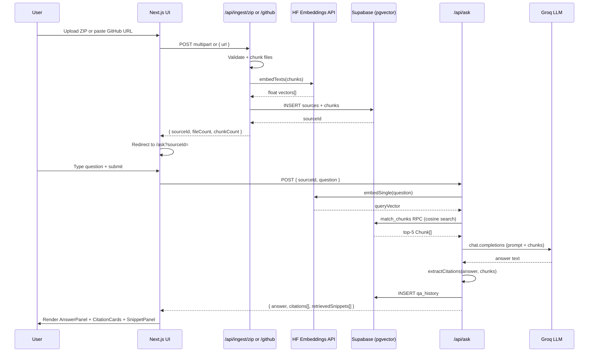

# Product Requirements Document (PRD)

## Product Name
Repo Lens (Option B Submission)

## Objective
Build a web app where users can ask questions about a codebase and receive answers with verifiable proof from source code.

## Target Users
- Developers reviewing unfamiliar repositories
- Hiring evaluators checking code understanding workflows
- Engineering teams doing quick codebase Q&A

## Success Criteria
- Users can ingest a codebase via ZIP upload or public GitHub URL
- Users can ask natural-language questions and get answers with citations
- Every answer includes file references and code evidence
- Last 10 Q&A entries are stored and visible
- App is publicly hosted and usable

## In Scope
- Input:
  - Upload ZIP of small codebase
  - Public GitHub repo URL ingestion
- Q&A:
  - Natural-language queries
  - Retrieval-based answer generation from indexed code
- Evidence:
  - File paths
  - Line ranges or exact snippets
  - Snippets shown in separate section
  - Clickable links for references
- History:
  - Persist and display last 10 Q&A interactions
- Health/Status page:
  - Backend health
  - Database health
  - LLM connection health
- Validation:
  - Empty input checks
  - Invalid ZIP checks
  - Invalid GitHub URL checks

## Out of Scope (for Option B MVP)
- Private repo integration
- Multi-user auth/roles
- Full semantic refactor suggestions
- Very large monorepo support

## Functional Requirements

### FR-1 Input Ingestion
- User can select one source mode: ZIP or GitHub URL
- GitHub URL must be validated as public
- ZIP must be validated for format and max size
- Binary files are skipped from indexing

### FR-2 Codebase Processing
- Extract textual files and chunk by file + line windows
- Preserve source metadata: repo path, start line, end line
- Enforce codebase size limits

### FR-3 Question Answering
- User submits natural-language question
- System retrieves relevant chunks
- LLM generates answer using only retrieved evidence
- If evidence is weak, answer must say insufficient context

### FR-4 Evidence Rendering (Mandatory)
Each answer shows:
- Referenced file paths
- Line ranges and/or exact snippets
- Snippets in a dedicated evidence panel
- Clickable file links (GitHub URLs for Git input, local file anchors for ZIP session)

### FR-5 Interaction History
- Save last 10 Q&A items with timestamp
- Show question, answer summary, and citations

### FR-6 Status Page
- `/status` page with:
  - Backend status
  - Database status
  - LLM provider status

## Non-Functional Requirements
- Deterministic, citation-based answers preferred
- No uncited/hallucinated claims
- Public deployment with live URL
- No secrets in repo
- Reasonable response time for small repos

## User Flow
1. Open Home page
2. Choose source type (ZIP/GitHub URL)
3. Ingest codebase
4. Ask question
5. View answer + citations + snippets
6. Review recent 10 interactions

## Acceptance Criteria
- All mandatory output evidence fields appear in UI
- Validation errors are actionable and clear
- Status page correctly reports subsystem states
- Required repository docs exist and are complete

I have created the following plan after thorough exploration and analysis of the codebase. Follow the below plan verbatim. Trust the files and references. Do not re-verify what's written in the plan. Explore only when absolutely necessary. First implement all the proposed file changes and then I'll review all the changes together at the end.

## Observations

The repo is a bare-docs scaffold — only `README.md`, `PRD.md`, `TRD.md`, `REQUIREMENTS.md`, `.env.example`, and `SUBMISSION_EMAIL_TEMPLATE.md` exist. No Next.js app, no `package.json`, no `src/` directory. The TRD already defines the data model (`sources`, `chunks`, `qa_history`), API surface, and validation rules. The `.env.example` still references OpenRouter/OpenAI — needs updating to Supabase + Groq + HF.

## Approach

Bootstrap a Next.js 15 App Router monorepo from scratch, wire Supabase (pgvector) for storage, HF Inference API for embeddings, and Groq for generation. All logic lives in `src/lib/` modules consumed by Route Handlers. UI is built with Next.js Server + Client Components. No extra frameworks beyond what Next.js 15 ships with.

---

## Phase Table

| # | Phase | Key Deliverables |
|---|-------|-----------------|
| 1 | Scaffold + Config | `package.json`, `tsconfig`, `next.config.ts`, `.env.example`, `src/types/`, `src/lib/db.ts`, `schema.sql` |
| 2 | Ingestion | `src/lib/ingestion/zip.ts`, `github.ts`, `chunker.ts`, `/api/ingest/zip`, `/api/ingest/github` |
| 3 | Embeddings + Retrieval | `src/lib/embeddings/hf.ts`, `src/lib/retrieval/search.ts` |
| 4 | Q&A Pipeline | `src/lib/qa/prompt.ts`, `groq.ts`, `citations.ts`, `/api/ask`, `/api/history`, `/api/status` |
| 5 | UI | `src/app/page.tsx`, `ask/page.tsx`, `history/page.tsx`, `status/page.tsx`, `src/components/` |
| 6 | Docs + Deploy | Updated `README.md`, `REQUIREMENTS.md`, `ABOUTME.md`, `PROMPTS_USED.md`, Vercel config |

---

## Phase 1 — Scaffold + Config

### Files to Create

```
package.json
tsconfig.json
next.config.ts
tailwind.config.ts
postcss.config.js
.env.example          ← update existing
schema.sql
src/types/index.ts
src/lib/db.ts
src/lib/config.ts
src/app/layout.tsx
src/app/globals.css
```

### `package.json` Dependencies

| Package | Purpose |
|---------|---------|
| `next@15` | Framework |
| `react@19`, `react-dom@19` | UI runtime |
| `typescript` | Type safety |
| `@supabase/supabase-js` | DB client |
| `@supabase/ssr` | Server-side Supabase helpers |
| `adm-zip` | ZIP parsing |
| `@octokit/rest` | GitHub API (public repos, no auth needed) |
| `groq-sdk` | Groq LLM client |
| `tailwindcss` | Styling |
| `zod` | Runtime validation |
| `uuid` | UUID generation |

### `.env.example` — Replace Existing Content

```
# App
NODE_ENV=development
NEXT_PUBLIC_APP_URL=http://localhost:3000

# Supabase
SUPABASE_URL=https://your-project.supabase.co
SUPABASE_ANON_KEY=your-anon-key
SUPABASE_SERVICE_ROLE_KEY=your-service-role-key

# Groq
GROQ_API_KEY=your-groq-api-key

# Hugging Face
HF_TOKEN=your-hf-token

# Limits
MAX_ZIP_SIZE_MB=25
MAX_TOTAL_FILES=1000
MAX_TOTAL_CHARS=4000000
MAX_FILE_CHARS=200000
```

### `schema.sql` — Supabase SQL Editor

Enable pgvector extension, then create three tables:

```
extensions: vector

sources(id uuid pk, type text, name text, github_url text, created_at timestamptz)

chunks(id uuid pk, source_id uuid fk→sources, file_path text, start_line int,
       end_line int, content text, embedding vector(768), source_url text)

qa_history(id uuid pk, source_id uuid fk→sources, question text, answer text,
           citations_json jsonb, created_at timestamptz)
```

Create an `ivfflat` index on `chunks.embedding` for cosine similarity search.

### `src/types/index.ts`

Define and export TypeScript interfaces matching the schema:
- `Source`, `Chunk`, `QAHistory`
- `Citation` (`{ filePath, startLine, endLine, snippet, sourceUrl }`)
- `AskResponse` (`{ answer, citations: Citation[], retrievedSnippets: Citation[] }`)
- `IngestResult` (`{ sourceId, fileCount, chunkCount }`)
- `StatusResult` (`{ backend, db, llm }`)

### `src/lib/db.ts`

Export a singleton Supabase client using `SUPABASE_URL` + `SUPABASE_SERVICE_ROLE_KEY` (server-only). Never expose service role key to client.

### `src/lib/config.ts`

Read and export all env-based limits (`MAX_ZIP_SIZE_MB`, `MAX_TOTAL_FILES`, etc.) with defaults.

### Acceptance Criteria
- `npm run dev` starts without errors
- Supabase client connects and `schema.sql` runs cleanly in Supabase SQL editor
- All types compile with zero TS errors

---

## Phase 2 — Ingestion

### Files to Create

```
src/lib/ingestion/zip.ts
src/lib/ingestion/github.ts
src/lib/ingestion/chunker.ts
src/lib/ingestion/filters.ts
src/app/api/ingest/zip/route.ts
src/app/api/ingest/github/route.ts
```

### `src/lib/ingestion/filters.ts`

Define `BINARY_EXTENSIONS` set (`.png`, `.jpg`, `.gif`, `.pdf`, `.exe`, `.zip`, `.woff`, etc.) and `isBinaryFile(filename)` helper. Also define `isTextFile(filename)` as the inverse.

### `src/lib/ingestion/chunker.ts`

`chunkFile(filePath, content, sourceUrl?)` → `Chunk[]`
- Split content into windows of ~60 lines with 10-line overlap
- Each chunk carries `start_line`, `end_line`, `content`, `file_path`, `source_url`
- Skip files exceeding `MAX_FILE_CHARS`

### `src/lib/ingestion/zip.ts`

`ingestZip(buffer: Buffer, sourceId: string)` → `IngestResult`
- Use `adm-zip` to read entries
- Validate total size ≤ `MAX_ZIP_SIZE_MB`
- Skip binary files via `filters.ts`
- Enforce `MAX_TOTAL_FILES` and `MAX_TOTAL_CHARS`
- Path traversal guard: reject entries with `..` in path
- Call `chunker.ts` per file, collect all chunks
- Bulk-insert into `chunks` table via `db.ts`

### `src/lib/ingestion/github.ts`

`ingestGitHub(repoUrl: string, sourceId: string)` → `IngestResult`
- Validate URL matches `https://github.com/{owner}/{repo}` (no auth, public only)
- Use `@octokit/rest` `repos.getContent` recursively (or `git.getTree` with `recursive: '1'`) to list all files
- For each text file: fetch raw content via `https://raw.githubusercontent.com/{owner}/{repo}/HEAD/{path}`
- Build `source_url` as `https://github.com/{owner}/{repo}/blob/HEAD/{path}#L{start}-L{end}`
- Same limits and chunking as ZIP path

### API Route Handlers

**`POST /api/ingest/zip`**
- Accept `multipart/form-data` with `file` field
- Validate MIME type and `.zip` extension
- Create `sources` row (`type: 'zip'`)
- Call `ingestZip()`
- Return `{ sourceId, fileCount, chunkCount }`

**`POST /api/ingest/github`**
- Accept JSON `{ url: string }`
- Validate URL with Zod regex
- Create `sources` row (`type: 'github'`)
- Call `ingestGitHub()`
- Return `{ sourceId, fileCount, chunkCount }`

### Acceptance Criteria
- ZIP upload of a 10-file repo produces correct chunk rows in Supabase
- GitHub URL `https://github.com/vercel/next.js` is rejected (too large) with clear error
- A small public repo (< 50 files) ingests successfully
- Binary files produce zero chunks
- Path traversal ZIP entries are rejected with 400

### Risk + Fallback
- **Risk:** GitHub API rate limit (60 req/hr unauthenticated). **Fallback:** Add optional `GITHUB_TOKEN` env var passed to Octokit; unauthenticated still works for small repos.
- **Risk:** `adm-zip` memory spike on large ZIPs. **Fallback:** Check `buffer.length` before parsing; reject early.

---

## Phase 3 — Embeddings + Retrieval

### Files to Create

```
src/lib/embeddings/hf.ts
src/lib/retrieval/search.ts
```

### `src/lib/embeddings/hf.ts`

`embedTexts(texts: string[])` → `number[][]`
- Call HF Inference API: `POST https://api-inference.huggingface.co/models/nomic-ai/nomic-embed-text-v1.5`
- Auth header: `Bearer ${HF_TOKEN}`
- Batch texts (max 32 per request to stay within free-tier limits)
- Return array of 768-dim float vectors
- Retry once on 503 (model loading)

`embedSingle(text: string)` → `number[]` — convenience wrapper

### Embedding During Ingestion

Update `zip.ts` and `github.ts` to call `embedTexts(chunks.map(c => c.content))` after chunking, then attach embeddings before bulk-insert into `chunks`.

### `src/lib/retrieval/search.ts`

`retrieveChunks(sourceId: string, queryEmbedding: number[], topK = 5)` → `Chunk[]`
- Use Supabase RPC calling a Postgres function `match_chunks(query_embedding, source_id, match_count)`
- The SQL function uses `<=>` cosine distance operator from pgvector
- Add this function to `schema.sql`

`hybridSearch(sourceId, query, queryEmbedding, topK)` → `Chunk[]`
- Run vector search + Postgres full-text search (`to_tsvector` on `content`)
- Merge and deduplicate results, prefer vector hits

### Acceptance Criteria
- `embedSingle("hello world")` returns a 768-element array
- `retrieveChunks` returns top-5 chunks ordered by cosine similarity
- Hybrid search returns results even when embedding similarity is low

### Risk + Fallback
- **Risk:** HF model cold start (20–30s). **Fallback:** Catch timeout, retry once; surface "embedding service warming up" error to user.
- **Risk:** pgvector not enabled on Supabase project. **Fallback:** `schema.sql` includes `CREATE EXTENSION IF NOT EXISTS vector;` — document this step in README.

---

## Phase 4 — Q&A Pipeline + APIs

### Files to Create

```
src/lib/qa/prompt.ts
src/lib/qa/groq.ts
src/lib/qa/citations.ts
src/lib/ratelimit.ts
src/app/api/ask/route.ts
src/app/api/history/route.ts
src/app/api/status/route.ts
```

### `src/lib/qa/prompt.ts`

`buildPrompt(question: string, chunks: Chunk[])` → `string`

Strict system prompt structure:
```
You are a code Q&A assistant. Answer ONLY using the provided evidence.
If the evidence is insufficient, respond: "Insufficient evidence in the indexed codebase."
Do NOT hallucinate. Every claim must reference a file path and line range.

Evidence:
[chunk 1: file_path lines start-end]
<content>
...

Question: {question}
```

### `src/lib/qa/groq.ts`

`generateAnswer(prompt: string)` → `string`
- Use `groq-sdk`: `client.chat.completions.create({ model: 'llama-3.1-8b-instant', messages: [...] })`
- Temperature: `0.1` (deterministic)
- Max tokens: `1024`

### `src/lib/qa/citations.ts`

`extractCitations(answer: string, chunks: Chunk[])` → `Citation[]`
- Parse answer text for file path mentions
- Cross-reference against retrieved chunks to build `Citation[]` with `filePath`, `startLine`, `endLine`, `snippet`, `sourceUrl`
- All retrieved chunks also returned as `retrievedSnippets` regardless of mention

### `src/lib/ratelimit.ts`

Simple in-memory rate limiter (Map of IP → request timestamps):
- Max 10 requests per minute per IP on `/api/ask`
- Returns `{ allowed: boolean, retryAfter?: number }`

### API Route Handlers

**`POST /api/ask`**
```
Request:  { sourceId: string, question: string }
Response: { answer: string, citations: Citation[], retrievedSnippets: Citation[] }
Errors:   400 (validation), 429 (rate limit), 503 (LLM unavailable)
```
Flow: validate → rate-limit → embed question → retrieve chunks → build prompt → Groq → extract citations → save to `qa_history` → respond

**`GET /api/history?sourceId={id}`**
```
Response: { history: QAHistory[] }   // last 10, ordered by created_at desc
```

**`GET /api/status`**
```
Response: {
  backend: { status: 'ok' },
  db: { status: 'ok' | 'error', message?: string },
  llm: { status: 'ok' | 'error', provider: 'groq', message?: string }
}
```
- DB check: run `SELECT 1` via Supabase
- LLM check: call Groq models list endpoint or a minimal completion

### API Contract Table

| Endpoint | Method | Auth | Request | Response |
|----------|--------|------|---------|----------|
| `/api/ingest/zip` | POST | none | `multipart/form-data { file }` | `{ sourceId, fileCount, chunkCount }` |
| `/api/ingest/github` | POST | none | `{ url }` | `{ sourceId, fileCount, chunkCount }` |
| `/api/ask` | POST | none | `{ sourceId, question }` | `{ answer, citations[], retrievedSnippets[] }` |
| `/api/history` | GET | none | `?sourceId=` | `{ history[] }` |
| `/api/status` | GET | none | — | `{ backend, db, llm }` |

### Acceptance Criteria
- `/api/ask` returns answer with ≥ 1 citation for any indexed repo
- Answer contains "Insufficient evidence" when `sourceId` has no chunks
- `/api/history` returns max 10 items
- `/api/status` returns `ok` for all three subsystems when configured
- Rate limiter blocks 11th request within 60s window

### Risk + Fallback
- **Risk:** Groq quota exhausted. **Fallback:** Catch 429, return `503` with `"LLM quota exceeded, try again later"`.
- **Risk:** No citations extracted from answer. **Fallback:** Return all retrieved chunks as `retrievedSnippets` even if `citations` is empty.

---

## Phase 5 — UI

### Files to Create

```
src/app/page.tsx                    ← Home (ingest flow)
src/app/ask/page.tsx                ← Ask + Answer
src/app/history/page.tsx            ← History
src/app/status/page.tsx             ← Status
src/components/IngestForm.tsx
src/components/AnswerPanel.tsx
src/components/CitationCard.tsx
src/components/SnippetPanel.tsx
src/components/HistoryList.tsx
src/components/StatusBadge.tsx
src/components/NavBar.tsx
```

### Page Wireframes

**Home (`/`)**
```
┌─────────────────────────────────────────┐
│  Repo Lens                    [Status]  │
├─────────────────────────────────────────┤
│  Step 1: Choose source                  │
│  ○ Upload ZIP   ○ GitHub URL            │
│                                         │
│  [ZIP: drag-drop / file picker]         │
│  OR                                     │
│  [GitHub URL input field]               │
│                                         │
│  [Ingest Codebase →]                    │
│                                         │
│  ✓ Ingested: 42 files, 310 chunks       │
└─────────────────────────────────────────┘
```

**Ask (`/ask?sourceId=...`)**
```
┌─────────────────────────────────────────┐
│  Ask a Question                         │
│  [Question textarea]                    │
│  [Ask →]                                │
├─────────────────────────────────────────┤
│  Answer                                 │
│  ┌─────────────────────────────────┐    │
│  │ <prose answer text>             │    │
│  └─────────────────────────────────┘    │
│                                         │
│  Citations                              │
│  • src/lib/db.ts  L12–L34  [↗ link]    │
│  • src/app/api/ask/route.ts L5–L20 [↗] │
│                                         │
│  Retrieved Evidence                     │
│  ┌─────────────────────────────────┐    │
│  │ // src/lib/db.ts:12-34          │    │
│  │ export const supabase = ...     │    │
│  └─────────────────────────────────┘    │
└─────────────────────────────────────────┘
```

**History (`/history?sourceId=...`)**
- Table/list of last 10 Q&A entries: timestamp, question, answer summary, citation count

**Status (`/status`)**
- Three `StatusBadge` components: Backend ✅, Database ✅, LLM (Groq) ✅

### Component Notes

- `IngestForm.tsx` — Client Component, manages ZIP/GitHub toggle, calls `/api/ingest/*`, stores `sourceId` in `localStorage` and redirects to `/ask?sourceId=`
- `AnswerPanel.tsx` — Renders prose answer + `CitationCard` list + `SnippetPanel`
- `CitationCard.tsx` — Shows `filePath`, `L{start}–L{end}`, clickable `sourceUrl` link
- `SnippetPanel.tsx` — Renders code block per retrieved chunk with syntax highlighting (use `<pre><code>` with Tailwind prose, no extra lib needed)
- `NavBar.tsx` — Links to Home, History, Status; shows current `sourceId` if present

### Acceptance Criteria
- Home page renders both ingest modes; validation errors shown inline
- After ingestion, user is redirected to `/ask` with `sourceId` in URL
- Answer panel always shows Citations section and Retrieved Evidence section
- History page shows ≤ 10 entries with timestamps
- Status page shows live subsystem health

---

## Phase 6 — Docs + Deployment

### Files to Update / Create

```
README.md              ← update with Supabase/Groq/HF setup steps
REQUIREMENTS.md        ← check off completed items
ABOUTME.md             ← create (name + resume link)
PROMPTS_USED.md        ← create (prompts only, no code)
vercel.json            ← optional: set function timeout to 60s for ingest
```

### `README.md` Updates
- Replace OpenRouter/Neon references with Supabase + Groq + HF
- Add Supabase setup step: enable pgvector, run `schema.sql`
- Add env var table for all 8 variables
- Add "What is implemented" and "What is not implemented" sections (already partially there)

### `vercel.json`
Set `functions` config to extend timeout for `/api/ingest/*` routes to 60 seconds (Vercel Hobby allows up to 60s).

### Deployment Steps
1. Push repo to public GitHub
2. Connect to Vercel, set all env vars from `.env.example`
3. In Supabase: enable pgvector extension, run `schema.sql`
4. Deploy; smoke-test `/status` → all green
5. Ingest a small public repo, ask one question, verify citations appear
6. Fill `SUBMISSION_EMAIL_TEMPLATE.md` with live URL + repo URL

### Final Submission Checklist

| Item | Check |
|------|-------|
| ZIP upload works | ☐ |
| GitHub URL ingestion works | ☐ |
| Q&A returns answer with citations | ☐ |
| Every answer has file path + line range + snippet | ☐ |
| Retrieved snippets shown separately | ☐ |
| Clickable file links in citations | ☐ |
| Last 10 history entries visible | ☐ |
| `/status` shows all green | ☐ |
| Validation errors shown for empty/invalid input | ☐ |
| No secrets in repo | ☐ |
| `.env.example` has only placeholders | ☐ |
| `README.md` complete | ☐ |
| `PROMPTS_USED.md` exists | ☐ |
| `ABOUTME.md` exists | ☐ |
| App live on Vercel | ☐ |
| Repo is public on GitHub | ☐ |
| Submission email sent with both URLs | ☐ |

---

## Data Flow Diagram

